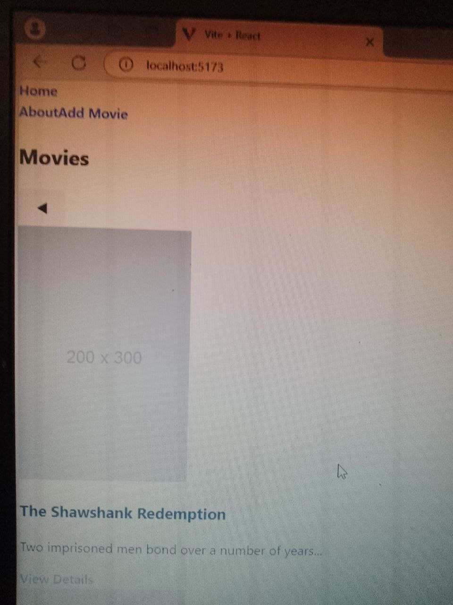

# Movie Database Project
A responsive React app for browsing, adding, and managing movies. Built with Tailwind CSS and Vite.

                          Movie Database
1. The project idea you chose and why:
I have chosen the Movie Database project because I have a deep interest in movies and enjoy exploring information about them, such as plot summaries, ratings, and cast details. This project will allow me to build a dynamic and interactive platform where users can search for movies and view detailed information. It also aligns with my goal of creating user-centric applications and applying my skills in frontend development using React JS and Tailwind CSS.
2. The API you’ll use, with a brief explanation of its features:
For this project, I will use the OMDB API (Open Movie Database) to fetch movie-related data. The OMDB API offers a wide range of features, including:
Searching for movies by title, year, and other parameters.
Retrieving detailed information about movies, such as plot summaries, ratings, actors, and release dates.
Supporting multiple languages and data formats.
Allowing access to a large database of movies from different genres.
This API is a perfect fit for the Movie Database project because it provides the necessary movie data in an easily accessible format that will allow users to search, view, and interact with the information efficiently.
3. A simple project timeline with key milestones:
Week 1:
Set up project environment (React JS with Tailwind CSS).
Research the OMDB API and familiarize myself with its endpoints.
Design a wireframe for the UI and decide on the structure of the app (e.g., home page, movie search results, and movie detail page).
Week 2:
Implement API integration to fetch movie data based on user input.
Display the list of movie results in a responsive layout.
Develop functionality for showing detailed movie information when a movie is selected.
Week 3:
Refine the UI with Tailwind CSS for better responsiveness and user experience.
Add additional features like pagination for movie results and error handling for no results or failed API calls.
Week 4:
Finalize the design, testing, and debugging.
Deploy the application on Netlify or Vercel.
Submit the final project with documentation.

